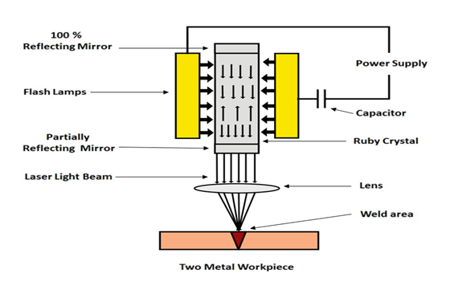
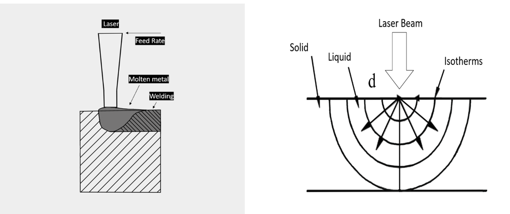
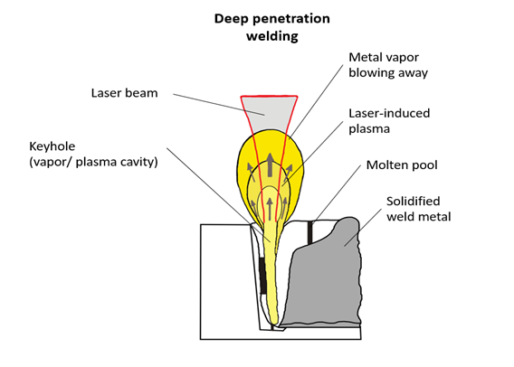
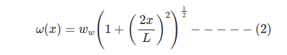
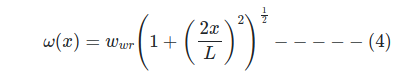
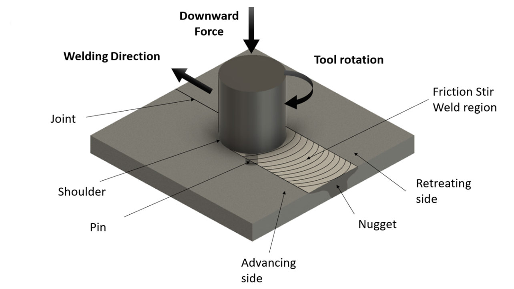

# Introduction

The Advanced Welding Techniques are as follows
- ***Laser Welding***
- ***Friction Stir Welding (FSW)***

# Laser Welding
# Introduction:

Laser welding belongs to a class of welding processes that uses high-intensity collimated laser beams focused to very small spot diameters. The laser is monochromatic or coherent and is focused at the focal plane It is a highly precise and efficient welding process that has gained popularity in various industries. Laser beam welding offers numerous advantages over traditional welding methods, making it the preferred choice for applications requiring exceptional accuracy and quality. Modern laser welding operations integrate programmable robots with advanced sensors in order to precisely target a specific area on the workpiece. 

  

#### Fig. 1. Basic setup of laser welding

# Theory

## Working Principle:
The term “laser” stands for “Light Amplification by Stimulated Emission of Radiation.” In laser welding, a laser beam is generated by stimulating atoms or molecules to release photons, which are then amplified to create a coherent and concentrated beam of light. The beam is then focused onto the workpiece using specialized optics. When a laser beam interacts with the material, it rapidly heats the surface, causing it to rapidly melt (and evaporate in some cases), thus forming a localized molten pool. As the laser moves along the joint, the metal melts and solidifies, creating a strong weld. Based on the way that the laser interacts with the material, laser beam welding is mainly divided into two categories.

- ***Laser Conduction Welding***

The laser conduction welding mode operates based on the principle of thermal conduction. During this welding process, the focused laser beam interacts with the workpiece, primarily heating the surface layer.  The heat energy enters the weld zone through the surface by conduction. In this mode the welding depth is limited. thus, the process is used for joining thin materials. In conduction welding mode, the depth-to-width aspect ratio is about 1.5. The aspect ratio can be controlled by varying process parameters like pulse duration and energy density. Depth can be controlled by changing the pulse duration. By keeping a long pulse duration, heat conduction will be more, and by shorter pulses, heat conduction will be less.  

  

#### Fig. 2. Laser Conduction welding

- ***Keyhole welding***

Keyhole welding is a mode of laser welding which is required to weld thick sheets or high depth of penetration. In this welding, the laser beam will heat the material to the point that it can vaporize the material by penetrating deep into it. This results in the formation of a hole referred to as a keyhole, which is then filled with either expanding plasma or vapour. This prevents the cavity walls from collapsing, resulting in temperatures beyond 10,000 K. Figure 3 depicts a schematic of the keyhole mode of laser welding. This welding can be performed by moving laser beam with respect to the weld joint.   Surface tension allows part of the molten material at the leading edge of the keyhole to flow around the cavity to the back, where it cools and solidifies to form the weld, this will continue until the weld is complete. High depth-to-weld ratios like depths of 0.1 to 10 mm in thickness can be achieved by keyhole welding. These welds should be performed at high energy densities, typically in the order of 2kW to 6 kW.  

  

#### Fig. 3. Schematic of a laser welding undergoing by keyhole mode

- ***Laser Beam Characteristics:***

***Beam Size:*** For a Gaussian-Beam, i.e., a beam having normally distributed intensity distribution at any plane perpendicular to the direction of propagation of the beam, the beam size/waist/radius from the centre of the beam is the distance at which intensity is 1/e2 of the intensity at the centre of the beam on the same plane. Or, it’s an area having 87.5% of the total beam energy at that section of the beam path. The beam size at the centre of the resonator cavity (i.e., at axial position x = 0) is given by Equation 1, where λ & L represent the laser wavelength and the distance between the mirrors in the cavity respectively. Further, at any general position x the beam size is given as Equation 1 & 2. However, for a real beam the above Equations can be expressed as 3 &4, where M2 is the beam-quality factor of the real beam.

For gaussian beam profile M2 = 1.

  

  

  

  

***Beam divergence:*** The beam-divergence is angle by which the beam diverges before & after the beam-waist along the path of propagation of the beam and is given by Equation 6 for a Gaussian-beam with limited diffraction, following the theory of diffraction. However, for a real beam it’s given by Equation 7, where M2 is the beam-quality factor of the real beam. For gaussian beam profile M2=1.

  

  

  

***Power density:*** Power density of the laser beam is dependent on the laser power & beam-size at the focal plane. The beam-size on the focal plane for a gaussian beam is given by Equation 9, where "f"  is the focal length of the focusing lens and ω_0 is the orignal beam-radius on the lens. Thus, the power density is given by Equation10.

  

  

***Depth of focus:*** It refers to the distance by which the focusing plane can be moved to & fro about the actual focusing plane with only 5% change in the laser beam size. The depth of focus is generally quantified with the help of Rayleigh Range of the laser beam, i.e., the distance from the beam-waist to the point along the beam-path where the beam-size is √2 × "beam-waist" . And is given by the Equation 11. The Rayleigh-range ±x_R is referred to as near-field range and the range x>>x_r is referred to as far-field range.

  

## Types of laser welding:

Lasers that are widely used for welding applications include CO2, Nd: YAG, and Fiber laser based on their wavelength, power output and beam diameter. The typical characteristics of some of these lasers are shown in Table 1. In the case of laser welding or other material processing operations, lasers are used as a high-intensity heat source for heating, melting, and vaporizing the material being processed. Some of the major characteristics of lasers that are significant for material processing applications like welding include power density & its distribution at the focal point, wavelength (λ), beam divergence quality & size.

			 
***Table 1. Characteristics of typical lasers used in welding***

|**Lasers** | **Wavelength (µm)** |**Avg. Power output (W)** |**Beam diameter (mm)**|
|:------|:-----:|:-----:|:-----:|
|CO2|10.6|	50-5000|	5-70|
|Nd: YAG	|1.06|	0.04-800|	0.02-0.05|
|Yb: Fiber|	1.03-1.11|	200-1000|	0.05-0.1|

## Applications of Laser Beam Welding
- ***Automobile sector:*** 
	Laser welding has revolutionized the automotive industry; welding of transmission components such as gears, couplings, differentials, body panels, fuel tanks, etc., is being done by laser welding.
- ***Specialized applications:***
	*	WC or diamond or WC-impregnated steels are joined to tooltips.
	*	Pipeline welding
	*	Bimetallic saw blade welding.
	*	Heart pacemaker welding
	*	Thin fins welded to a high-finned tube heat exchanger
	*	Aerospace components like landing gears and aircraft fuselages.
	*	Joining of electronic components, such as microcircuits, sensors, etc. is done due to minimal HAZ.

## Advantages
1.	Small heat-affected zone
2.	Filler metal is not necessary
3.	Secondary finishing process is not necessary
4.	Highly accurate
5.	Low total thermal input
6.	It is possible to transmit over long distances with only a small amount of power being lost.
7.	 It can join dissimilar materials.

## Limitations
1.	Due to the rapid cooling rate, certain metals may crack.
2.	The initial acquisition cost of laser setup is very high.
3.	Maintenance cost is very high.
4.	Difficult to weld highly reflective materials, such as copper and aluminum.
5.	It requires a clear line of sight between the laser beam source and workpiece. Complex geometries of the workpiece can obstruct the welding process.

# Friction Stir Welding (FSW)
# Introduction:
Friction Stir Welding (FSW) is a solid-state welding that uses a rotating tool to create frictional heat. The generated heat and the stirring motion of the rotating tool cause plasticizing action of the material to create a weld. FSW is based on friction, plastic deformation, and material flow. The heat produced by the tool and workpiece rubbing against one another in relative motion softens and mixes the material, creating a homogeneous weld zone with improved mechanical properties compared to traditional welding methods. The unique aspect of FSW is that it takes place below the material's melting point and results in minimal heat-affected zones and reduced residual stresses. 
  
  

#### Fig 4. Schematic representation of friction stir welding Process.

  
          

# Theory
A rotating tool is used in the friction stir welding (FSW) method to heat and plasticize the material, leading to a coalescence of the two parts. The process occurs below the material’s melting point, making it a unique method for welding aluminium and other high-temperature alloys.

## Working principle:
In FSW, a rotating tool with a specially shaped pin and shoulder is pressed onto the surface of the materials to be joined. The pin generates friction between the materials and the rotating tool, which creates heat and plasticizes the material. The material flows around the pin as its get displaced from advancing side to retreating side of the tool, creating a solid state weld. The tool is moved along the weld line at a controlled speed, resulting in a homogeneous weld.

## Components:
1.	***FSW tool:*** The tool is the most critical component in the FSW process, consisting of a pin and a shoulder. The tool is typically made of a hard, wear-resistant material.   The pin and shoulder generate heat in the work material by friction. The pin helps in stirring the plasticized metal and it also contained various shapes that help in better mixing and stirring of the work material. The shoulder controls the depth of penetration and width of the weld and also helps in preventing the flow of material outside the sir zone.
2.	***Welding machine:*** The welding machine rotates and advances the FSW tool along the joint line. The machine should have the capability to control the rotation speed, axial force, and traverse speed of the tool.
3.	***Fixture:*** The fixture is used to clamp the materials in place during the welding process. It should provide sufficient clamping force to hold the materials together and prevent them from moving during welding.
4.	***Power source:*** The power source provides the necessary power to rotate the FSW tool and control the axial force applied. It may be a conventional power source or a servo-controlled motor.
5.	***Cooling system:*** It prevents the material and tool overheating during welding.

In conclusion, Friction Stir Welding is a versatile and efficient method for welding aluminum and other high-temperature alloys. The critical components of the process include the FSW tool, welding machine, fixture, power source, and cooling system. These components allow FSW to produce solid and homogeneous welds with minimal distortion and residual stress.

## Friction Stir Welding (FSW) process parameters and their influence on the weld are:
1.	***Tool rotational speed:*** The tool’s rotational speed directly impacts the heat input and the temperature of the material. Higher rotational speeds increase the heat input and can cause higher temperatures in the weld.
2.	***Tool traverse speed:*** The traverse speed of the tool influences the size and shape of the weld, as well as the heat input into the material. Slower traverse speeds result in larger, more convex welds with lower heat input, while faster traverse speeds result in smaller, more concave welds with higher heat input.
3.	 ***Torque:*** This is an important parameter in FSW as it depends on the tool rotational speed and tool traverse speed. It effects the stir zone characteristics and formation of defects. It directly influences the temperature of the weld zone.
4.	***Tool plunge depth:*** The depth at which the tool plunges into the material directly impacts the strength and quality of the weld. Deeper plunges result in stronger welds, but can also increase the risk of defects and porosity.
5.	***Shoulder diameter and shape:*** The shape and size of the shoulder determine the amount of material displaced during the welding process and can impact the strength and quality of the weld.
6.	***Pin profile:*** The shape of the pin profile affects the flow of the material and the amount of heat generated during the welding process. Different pin profiles can be used to optimize the process for specific materials and applications.
7.	***Tool tilt angle:*** The tilt angle of the tool affects the amount of material displaced and the weld’s size and shape. Tilt angles that are too steep can cause the material to be squeezed out of the weld, while tilt angles that are too shallow can result in insufficient penetration and incomplete welds.
8.	***Welding zone temperature:*** The temperature of the material during the welding process affects the strength and quality of the weld. Excessive temperatures can cause the material to soften and deform, while low temperatures can result in incomplete welds.

